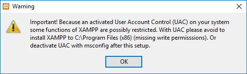
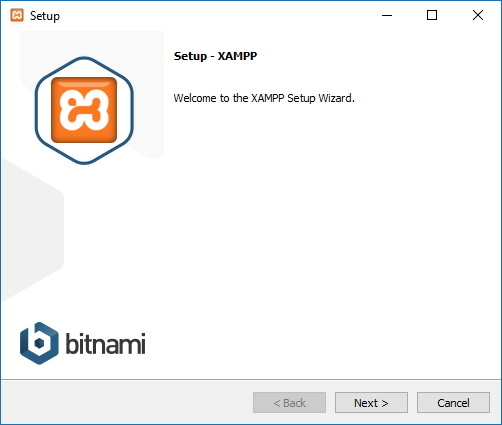
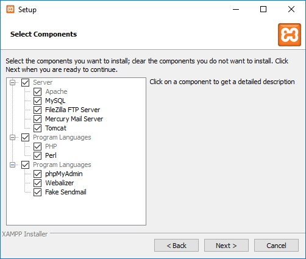
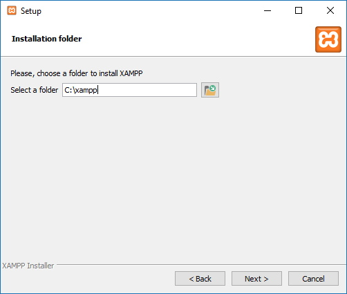
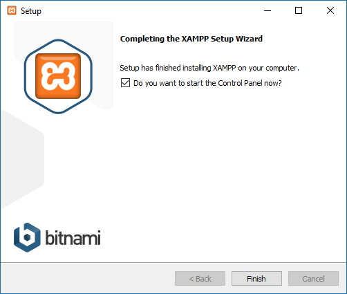
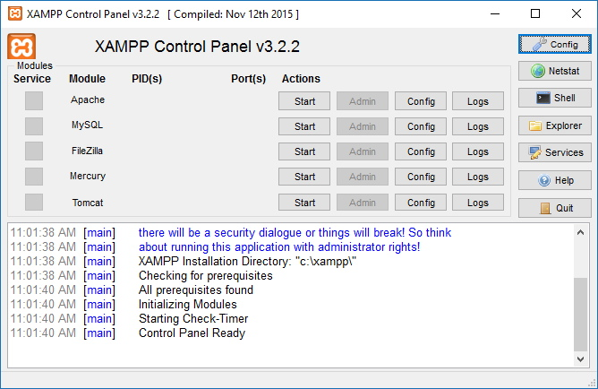

## Pengantar dan Pemasangan XAMPP
### Pengantar

XAMPP merupakan sebuah paket aplikasi yang digunakan untuk membangun server web. Arti dari XAMPP adalah:

| Huruf        | Arti           | 
| :-------------: |-------------|
|X|Program ini dapat dijalankan dibanyak sistem operasi, seperti Windows, Linux, Mac OS, dan Solaris.|
|A| **Apache**, merupakan perangkat lunak untuk web server
|M| ~~MySQL~~ MariaDB
|P| [PHP](../php/README.md)
|P| PERL

Dengan menggunakan aplikasi XAMPP kita tidak perlu melakukan pemasangan setiap aplikasi yang dibutuhkan dalam pengembangan web secara terpisah. 

### Pemasangan
1. Aplikasi XAMPP bisa didapatkan melalui laman [https://www.apachefriends.org/download.html](https://www.apachefriends.org/download.html)
2. Jalankan file *installer* XAMPP  
   * Pada beberapa sistem operasi windows akan muncul peringatan terkait *User Account Control (UAC)*. Abaikan pesan tersebut lalu pilih **OK** untuk melanjutkan. 
    
    

   * Klik tombol **Next** 
    
    

3. Selanjutnya muncul jendela untuk memilih komponen apa saja yang akan dipasang. Pasang komponen secara *default* dengan mengklik tombol **Next** 
   
   

4. Jendela selanjutnya akan menampilkan lokasi dimana XAMPP akan dipasang. Secara default direktori XAMPP pada Windows berada di `C:\XAMPP`, pada sistem operasi Linux di `/opt/lampp` sedangkan MacOS di `/Applications/XAMPP/` 
   
    
   
   Klik **Next** jika telah menyesuaikan direktori instalasi
5. Tunggu proses pemasangan selesai, kemudian klik tombol **Finish**
   
   

6. Setelah pemasangan selesai kita bisa menjalankan service yang dibutuhkan untuk pengembangan web melalui **XAMPP Control Panel** 
   
   
   
   > Untuk PHP dan MySQL kita hanya perlu menjalankan service apache dan mysql saja.
