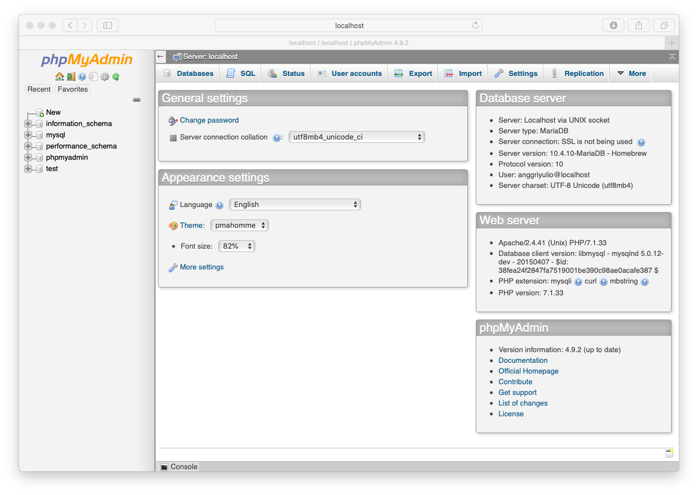
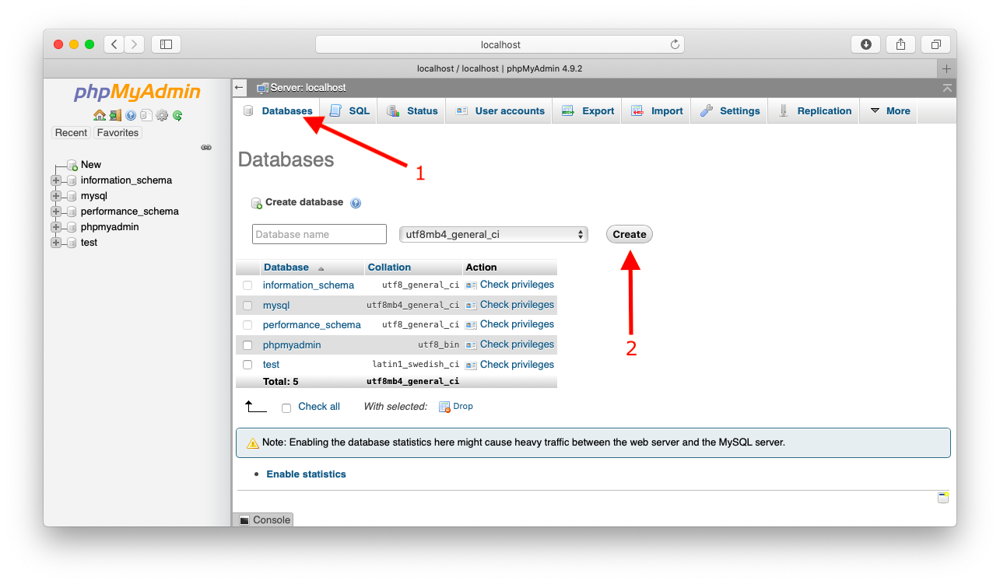
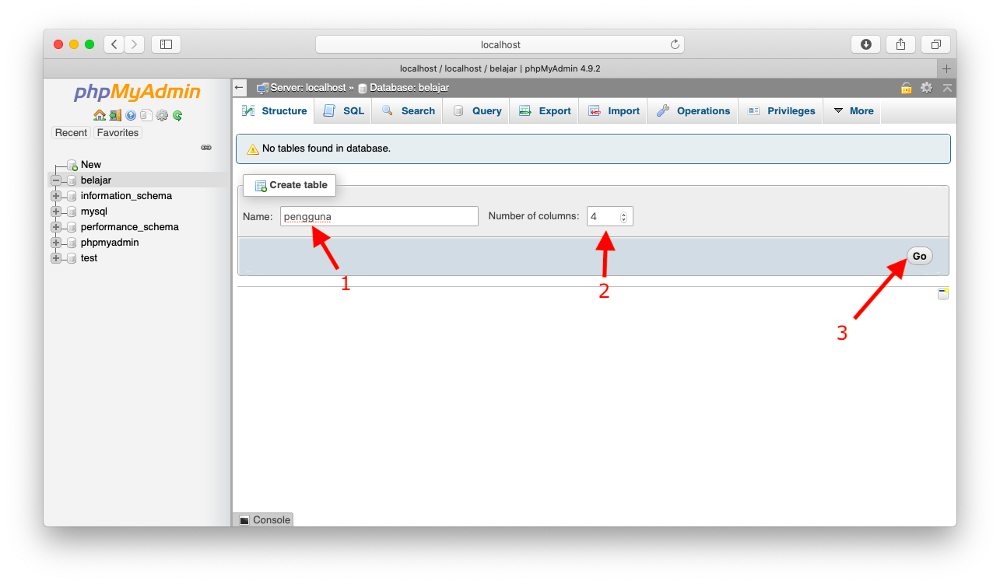
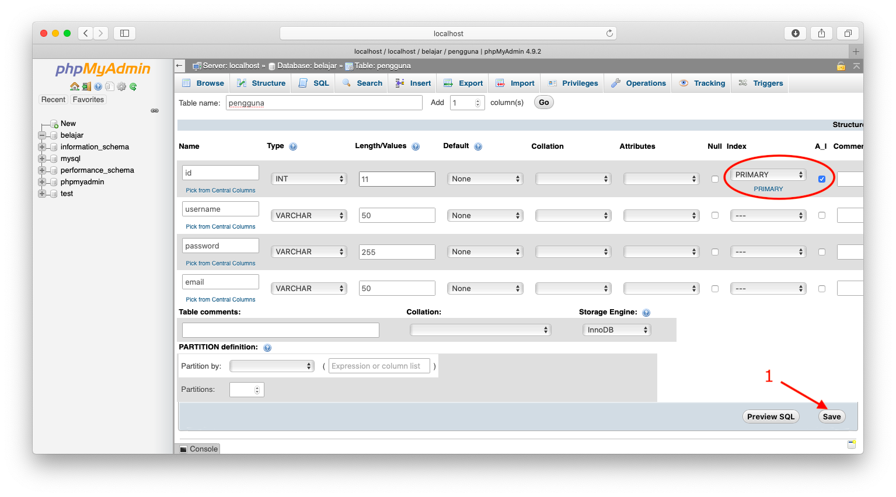
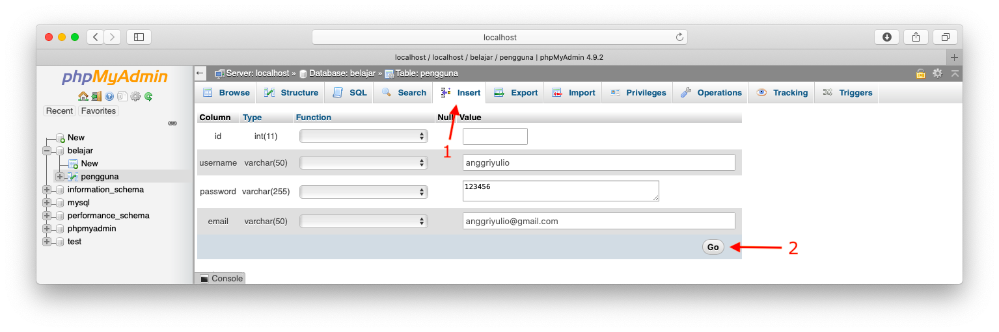
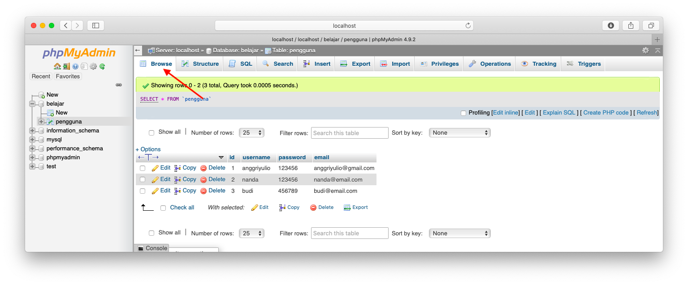
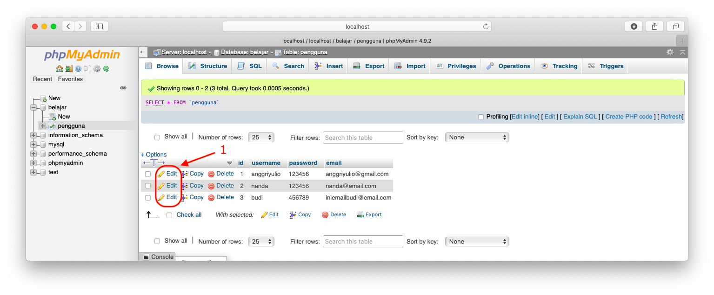
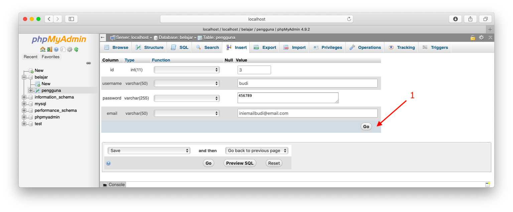
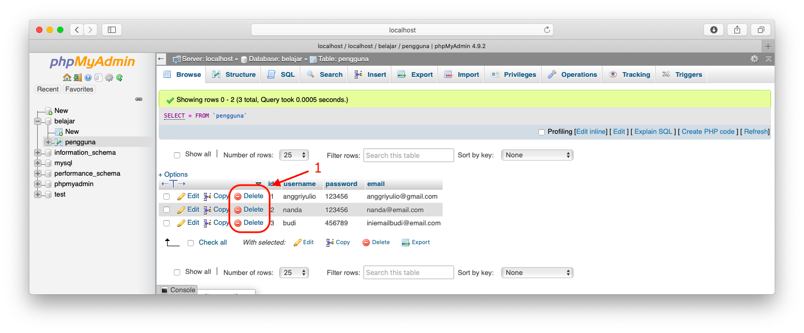

### PhpMyAdmin dan Mengelola Database
**PhpMyAdmin** adalah perangkat lunak bebas yang ditulis dalam bahasa pemrograman PHP yang digunakan untuk menangani administrasi MySQL melalui. Dengan kata lain PhpMyAdmin merupakan antarmuka yang mempermudah kita dalam melakukan mengelola MySQL dan MariaDB.

PhpMyAdmin dapat diakses melalui tautan [http://localhost/phpmyadmin](http://localhost/phpmyadmin) dengan terlebih dahulu menjalankan service Apache dan MySQL pada control panel XAMPP.

*Antarmuka PhpMyadmin*

#### Mengelola Database
##### Membuat Database dan Tabel
Pada tab menu phpmyadmin pilih **Databases**, masukan nama database yang akan dibuat lalu klik **Create** 

Selanjutnya kita diarahkan kehalaman pembuatan tabel. Disini saya membuat table `pengguna` yang di dalamnya terdapat 4 kolom.

Selanjutnya definisikan kolom yang akan dibuat pada tabel `pengguna`, struktur tabel yang saya buat adalah:
|Kolom|Tipe Data|Panjang|Keterangan|
|-----|---------|:-------:|----------|
|id|Integer|11|Primary Key, Auto Increments|
|username|Varchar|50||
|password|Varchar|255||
|email|Varchar|50||

##### Memanipulasi Data
1. Menambah Data (Insert)
Untuk memasukan data baru, pilih melalui menu ***Insert*** lalu isikan borang yang tersedia dan klik **Go** 
> Cobalah untuk masukan beberapa tambahan data

2. Melihat Data (Select)
Untuk melihat daftar record yang sudah dimasukan sebelumnya, dengan memilih menu **Browse** 

3. Mengubah Data (Update)
Untuk mengubah data yang telah dimasukan sebelumnya, dengan mengklik tombol edit.  
Kemudian ubah data yang diinginkan lalu klik Go 

4. Menghapus Data (Delete)
Untuk menghapus data yang telah dimasukan sebelumnya, dengan mengklik tombol delete. 
